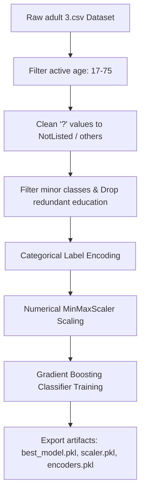

# 💼 Employee Salary Prediction using Machine Learning

[](https://dinesh9997-employee-salary-prediction-app-cinlrc.streamlit.app/)
[](https://www.python.org/)
[](https://scikit-learn.org/)
[](https://opensource.org/licenses/MIT)

An end-to-end Machine Learning web application designed to predict whether an individual earns more than $50,000 annually (`>50K`) or less (`<=50K`) based on their demographic and professional census profiles. 

This project was successfully built and deployed as part of the **Artificial Intelligence & Machine Learning internship** under the **AICTE – Edunet Foundation program**.

---

## 🌐 Live Web Application

The predictor application is deployed and accessible globally! Try out the interactive single predictor and drag-and-drop batch prediction features:

👉 **[Live Web App Demo](https://dinesh9997-employee-salary-prediction-app-cinlrc.streamlit.app/)**

---

## ✨ Features

* **🎯 Interactive Single Prediction**:
  * Real-time sliders and responsive dropdown inputs mapped to demographic data.
  * Instant visual feedback cards (Emerald/Amber styling) with detailed probability estimation metrics.
* **📂 Seamless Batch Processing**:
  * Drag-and-drop CSV file uploader to process hundreds of records simultaneously.
  * Metrics dashboard displaying total records processed and ratio of standard vs. high-income predictions.
  * Single-click predicted report download as a formatted CSV file.
* **📈 Model Insights Dashboard**:
  * Transparent overview of classifier parameters, testing set performance, and key driving features (e.g. Capital Gain and Educational Level).
* **🎨 Premium Dark UI Design**:
  * Sleek glassmorphism look, harmonious spacing, custom card metric layouts, and Outfit typography.

---

## ⚙️ The Preprocessing & Machine Learning Pipeline

Raw data is highly noisy. The custom [train_pipeline.py](train_pipeline.py) cleans, encodes, and scales dataset inputs prior to model execution:



### 🤖 Classifier Performance
We tested five classification models on the processed dataset:
* **Logistic Regression**: `82.76%`
* **Random Forest Classifier**: `86.37%`
* **K-Nearest Neighbors**: `82.91%`
* **Support Vector Classifier (SVC)**: `85.47%`
* **Gradient Boosting Classifier (Winner)**: **`87.10%`** (Deployed)

---

## 💻 Local Setup Instructions

Follow these steps to run the application locally on your computer:

### 1. Clone the repository
```bash
git clone https://github.com/dinesh9997/employee-salary-prediction.git
cd employee-salary-prediction
```

### 2. Install dependencies
Ensure you have Python 3.8+ installed, then run:
```bash
pip install -r requirements.txt
```

### 3. Pre-process and train the model
Execute the training script to generate the required model and pipeline preprocessing artifacts:
```bash
python train_pipeline.py
```

### 4. Run the Streamlit Web Server
```bash
python -m streamlit run app.py
```
Open **[http://localhost:8501](http://localhost:8501)** in your browser to view your live local application!

---

## 👤 Author

* **Gujju Dinesh**
* *Artificial Intelligence & Machine Learning Intern*
* Developed under AICTE – Edunet Foundation Program.
